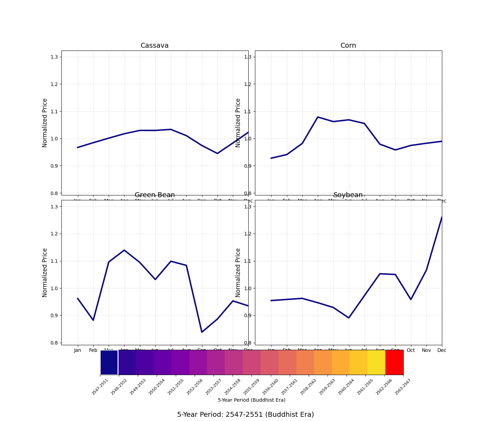
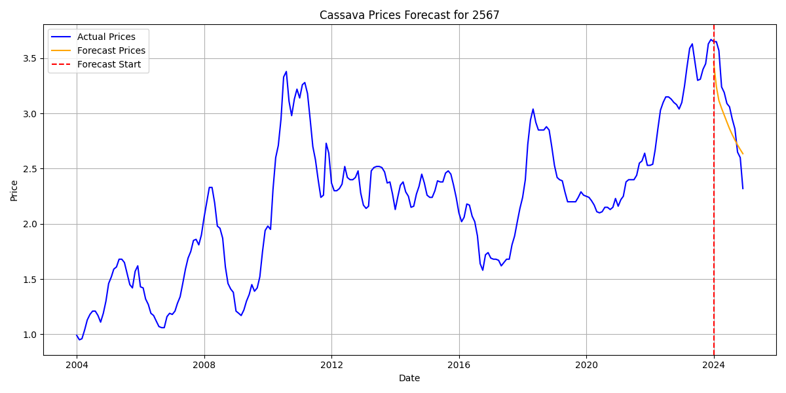

# AI Crop Land-Use Analysis and Price Forecasting

A machine learning project for analyzing and forecasting crop prices, specifically focusing on cassava, corn, green beans, and soybean agricultural commodities in Thailand. This project combines data preprocessing, visualization, and deep learning models to predict future crop prices based on historical data.

## 🌾 Project Overview

This project aims to:
- Analyze historical crop price data for cassava, corn, green beans, and soybean
- Clean and preprocess agricultural price data
- Visualize price trends and patterns
- Develop neural network models for price forecasting
- Calculate potential income per rai (Thai land measurement unit)
- Provide insights for agricultural decision-making

## 📁 Project Structure

```
AI Crop Land-Used/
├── GIL-TEST.py                        # Python GIL status testing utility
├── README.md                          # Project documentation
├── requirements.txt                   # Python dependencies
├── data/
│   ├── crops_info/
│   │   └── crops_info_data.txt        # Information about crops
│   ├── data_processed/
│   │   ├── cassava/
│   │   │   ├── price_avg.csv          # Processed cassava price data
│   │   │   └── price_low_high.csv     # Processed cassava min-max price data
│   │   ├── corn/
│   │   │   ├── price_avg.csv          # Processed corn price data
│   │   │   └── price_low_high.csv     # Processed corn min-max price data
│   │   ├── green_bean/
│   │   │   └── price_avg.csv          # Processed green beans price data
│   │   └── soybean/
│   │       └── price_avg.csv          # Processed soybean price data
│   └── raw/
│       ├── cassava/
│       │   ├── price_avg.xls          # Raw cassava price data (Excel)
│       │   └── price_min-max.xls      # Cassava min-max price data (Excel)
│       ├── corn/
│       │   ├── price_avg.xls          # Raw corn price data (Excel)
│       │   └── price_min-max.xls      # Corn min-max price data (Excel)
│       ├── green_bean/
│       │   └── price_avg.csv          # Raw green beans price data (CSV)
│       └── soybean/
│           └── price_avg.csv          # Raw soybean price data (CSV)
├── src/
│   ├── (1) 5-Year ARIMA.ipynb         # 5-Year forecast using ARIMA model
│   ├── (1) 5-Year LSTM.ipynb          # 5-Year forecast using LSTM model
│   ├── (1) 5-Year Transformer.ipynb   # 5-Year forecast using Transformer model
│   ├── (2) ARIMA Model.ipynb          # ARIMA-based forecasting model notebook
│   ├── (2) LSTM Model.ipynb           # LSTM-based forecasting model notebook
│   ├── (2) Transformer Model.ipynb    # Transformer-based forecasting model notebook
│   ├── Data Analytical.ipynb          # Data analysis and visualization notebook
│   ├── Error Analytical.ipynb         # Error analysis and evaluation notebook
│   ├── Gantt chart.ipynb              # Crop planning and rotation visualization
│   ├── Overlap_price.ipynb            # Price overlap analysis notebook
│   ├── data preparation/              # Data preprocessing modules
│   │   ├── data_cleanup.py            # Data cleaning utilities
│   │   ├── data_plot.py               # Data visualization tools
│   │   └── raw_data_path.py           # Raw data path utilities
│   ├── error_record/                  # Error metrics organized by model type
│   │   ├── (5)-ARIMA/                 # 5-Year ARIMA model error metrics
│   │   ├── (5)-LSTM/                  # 5-Year LSTM model error metrics
│   │   ├── (5)-Transformer/           # 5-Year Transformer model error metrics
│   │   ├── ARIMA/                     # ARIMA model error metrics
│   │   ├── LSTM/                      # LSTM model error metrics
│   │   └── Transformer/               # Transformer model error metrics
│   │       ├── cassava_error_metrics.txt
│   │       ├── corn_error_metrics.txt
│   │       ├── green_bean_error_metrics.txt
│   │       └── soybean_error_metrics.txt
│   ├── forecast_price/                # Model forecasts organized by model type
│   │   ├── (5)-ARIMA/                 # 5-Year ARIMA model forecasts
│   │   ├── (5)-LSTM/                  # 5-Year LSTM model forecasts
│   │   ├── (5)-Transformer/           # 5-Year Transformer model forecasts
│   │   ├── ARIMA/                     # ARIMA model forecasts
│   │   ├── LSTM/                      # LSTM model forecasts
│   │   └── Transformer/               # Transformer model forecasts
│   │       ├── cassava_forecast.txt
│   │       ├── corn_forecast.txt
│   │       ├── green_bean_forecast.txt
│   │       └── soybean_forecast.txt
│   ├── image/                         # Visualizations directory
│   │   ├── analytical/                # Data analysis visualizations
│   │   ├── error/                     # Error visualizations by model type
│   │   ├── forecast/                  # Forecast visualizations
│   │   ├── gantt chart/               # Gantt chart visualizations
│   │   └── transitions/               # Transition visualizations and GIFs
│   ├── model/                         # Model-specific notebooks
│   │   └── (0) 5-Year NRP LSTM.ipynb  # Neural Radiance Field LSTM model
│   └── util/                          # Utility modules
│       ├── data_path.py               # Data path utilities
│       ├── lstm_cust_class.py         # Custom LSTM model class
│       ├── parse_loc.py               # Location parsing utilities
│       ├── transformer_cust_class.py  # Custom Transformer model class
```

## 🚀 Features

- **Data Preprocessing**: Clean and prepare raw agricultural price data
- **Data Visualization**: Generate plots for price trend analysis
- **Time Series Forecasting**: 
  - LSTM-based neural network for price prediction
  - Transformer-based model for advanced sequence analysis
  - ARIMA statistical model for comparison
- **Multi-Crop Support**: Handles cassava, corn, green beans, and soybean price data
- **Thai Date Processing**: Handles Thai Buddhist calendar dates
- **Scalable Architecture**: Modular design for easy extension to other crops
- **Interactive Application**: Web-based interface for price analysis and forecasting
- **Price Balancing**: Algorithms for calculating balanced crop prices
- **Structured Logging**: Comprehensive logging system for debugging and monitoring
- **Gantt Chart Analysis**: Visualize optimal crop planting and harvesting schedules
- **Crop Rotation Optimization**: Optimize crop rotation patterns for maximum yield and profit

## 📊 Data Description

The project works with Thai agricultural price data:
- **Time Period**: 2547-2568 BE (2004-2025 CE)
- **Frequency**: Monthly price data
- **Crops**: Cassava, Corn, Green Beans, and Soybean
- **Price Types**: Average, minimum, and maximum prices
- **Currency**: Thai Baht (THB)
- **Additional Data**: Weather data for correlation analysis

## 🛠️ Installation

1. **Clone the repository**:
   ```bash
   git clone https://github.com/LoveMig6334/Ai-Crop-Land-Used.git
   cd "AI Crop Land-Used"
   ```

2. **Create Python Environment (version 3.12+)**:
   ```bash
   python -m venv .venv
   ```

   Alternative using Conda:
   ```bash
   conda create -n crop-forecasting python=3.12
   ```

3. **Activate the environment**:
   - Windows PowerShell:
   ```powershell
   .venv\Scripts\activate
   ```
   - Windows Command Prompt:
   ```cmd
   .venv\Scripts\activate.bat
   ```
   - Linux/Mac:
   ```bash
   source .venv/bin/activate
   ```
   - Conda (all platforms):
   ```bash
   conda activate crop-forecasting
   ```

4. **Install dependencies**:
   ```bash
   pip install -r requirements.txt
   ```

5. **Verify installation**:
   ```bash
   python -c "import torch; print(torch.__version__)"
   ```

6. **Verify GPU support** (Optional):
   ```bash
   python -c "import torch; print('GPU Available:', torch.cuda.is_available()); print('GPU Device:', torch.cuda.get_device_name(0) if torch.cuda.is_available() else 'None')"
   ```

7. **Check GIL and Python status** (Optional):
   ```bash
   python GIL-TEST.py
   ```

## 💻 Usage

### Price Forecasting

1. **Open the Jupyter notebook for standard forecasting models**:
   ```bash
   jupyter notebook "src/(2) LSTM Model.ipynb"
   # or
   jupyter notebook "src/(2) Transformer Model.ipynb"
   # or
   jupyter notebook "src/(2) ARIMA Model.ipynb"
   ```

2. **Open the Jupyter notebook for 5-Year forecasting models**:
   ```bash
   jupyter notebook "src/(1) 5-Year LSTM.ipynb"
   # or
   jupyter notebook "src/(1) 5-Year Transformer.ipynb"
   # or
   jupyter notebook "src/(1) 5-Year ARIMA.ipynb"
   ```

3. **Run the forecasting model**:
   - Execute all cells in the notebook
   - The model will train on historical data and generate predictions
   - Results will be saved as visualizations and text files in the `forecast_price` directory organized by model type

4. **Compare model results**:
   ```bash
   jupyter notebook "src/Overlap_price.ipynb"
   ```
   - View overlapping predictions from different models
   - Results will be saved in the `image/analytical` directory

5. **Analyze crop planting schedules**:
   ```bash
   jupyter notebook "src/Gantt chart.ipynb"
   ```
   - Visualize optimal planting and harvesting schedules
   - Compare optimized vs. non-optimized crop rotation patterns
   - Results will be saved in the `image/gantt chart` directory

6. **Analyze data trends and patterns**:
   ```bash
   jupyter notebook "src/Data Analytical.ipynb"
   ```
   - Analyze historical price data and trends
   - View statistical analysis and visualizations

7. **Review model errors and performance**:
   ```bash
   jupyter notebook "src/Error Analytical.ipynb"
   ```
   - Compare error metrics across different models
   - Analyze model performance by crop type

### Income Analysis

1. **View income calculations per rai**:
   ```bash
   jupyter notebook "src/model/income_per_rai/income_plot.ipynb"
   ```
   - Analyze potential income based on forecasted prices
   - Results provide insights for optimal crop selection

### Web Application

1. **Start the web application**:
   ```bash
   python src/app.py
   ```

2. **Access the application**:
   - Open your browser and navigate to `http://localhost:5000`
   - Use the interactive dashboard to explore crop price data
   - Generate forecasts and visualizations through the web interface

3. **Use CLI version** (alternative):
   ```bash
   python src/app_cli.py
   ```
   - Command-line interface for quick data access
   - Generate reports and analysis from terminal

### Key Components

#### Data Cleaning (`data_preparation/data_cleanup.py`)
- Removes unwanted Thai language columns
- Standardizes data format
- Prepares data for analysis

#### Data Visualization (`data_preparation/data_plot.py`)
- Generates price trend plots
- Handles Thai date format conversion
- Provides statistical summaries

#### Raw Data Path Management (`data_preparation/raw_data_path.py`)
- Manages paths to raw data files
- Facilitates data import from various sources
- Standardizes file access across the project

#### Data Path Utilities (`util/data_path.py`)
- Centralized path management for processed data
- Consistent path access across notebooks
- Configuration-based path resolution

#### Custom Model Classes
**LSTM Custom Class** (`util/lstm_cust_class.py`)
- Custom LSTM architecture implementation
- Time-series specific neural network design
- PyTorch-based deep learning components

**Transformer Custom Class** (`util/transformer_cust_class.py`)
- Self-attention based sequence model implementation
- Advanced neural network architecture for time series
- Custom layers and attention mechanisms

#### Forecasting Models
**Standard Models**
**LSTM Model** (`(2) LSTM Model.ipynb`)
- LSTM neural network implementation
- Time series preprocessing with MinMaxScaler
- Standard forecasting period
- PyTorch-based deep learning pipeline

**Transformer Model** (`(2) Transformer Model.ipynb`)
- Self-attention based sequence model
- Advanced pattern recognition capabilities
- Parallelized computation for faster training
- State-of-the-art neural network architecture

**ARIMA Model** (`(2) ARIMA Model.ipynb`) 
- Statistical time series forecasting
- Auto-regressive Integrated Moving Average
- Traditional statistical approach for comparison

**5-Year Forecast Models**
**5-Year LSTM Model** (`(1) 5-Year LSTM.ipynb`)
- Extended LSTM architecture for longer forecasting periods
- Specialized for 5-year predictions
- Optimized for long-term pattern recognition

**5-Year Transformer Model** (`(1) 5-Year Transformer.ipynb`)
- Extended transformer architecture for 5-year forecasts
- Enhanced attention mechanisms for long-term dependencies
- Optimized for capturing long-range patterns

**5-Year ARIMA Model** (`(1) 5-Year ARIMA.ipynb`)
- Extended statistical forecasting for 5-year periods
- Parameter optimization for long-term predictions
- Seasonal components for multi-year patterns

**Advanced Model Experiments**
**Neural Radiance Field LSTM** (`model/(0) 5-Year NRP LSTM.ipynb`)
- Experimental model combining neural radiance fields with LSTM
- Advanced approach for 5-year forecasting
- Research-oriented implementation

## 🧠 Model Architecture

The project implements multiple forecasting approaches with both standard and 5-year prediction horizons:

### Standard Forecasting Models (1-Year Horizon)

**LSTM Model:**
- **Input**: 12 months of historical price data
- **Architecture**: LSTM (Long Short-Term Memory) neural network
- **Output**: 12 months of future price predictions
- **Framework**: PyTorch
- **Preprocessing**: MinMaxScaler for data normalization
- **Custom Implementation**: Uses `util/lstm_cust_class.py` for model definition

**Transformer Model:**
- **Input**: Historical price data sequence
- **Architecture**: Self-attention mechanism with encoding layers
- **Output**: Future price predictions with confidence intervals
- **Framework**: PyTorch
- **Advantages**: Better at capturing long-range dependencies in time series data
- **Custom Implementation**: Uses `util/transformer_cust_class.py` for model definition

**ARIMA Model:**
- **Input**: Historical time series data
- **Method**: Auto-Regressive Integrated Moving Average
- **Components**: AR (auto-regression), I (differencing), MA (moving average)
- **Libraries**: statsmodels, statsforecast

### 5-Year Forecasting Models

**5-Year LSTM Model:**
- **Extended Architecture**: Specialized LSTM configuration for long-term forecasting
- **Input**: Extended historical data sequences
- **Output**: 60 months (5 years) of future price predictions
- **Enhanced Features**: Additional regularization and optimization for long-term stability

**5-Year Transformer Model:**
- **Extended Architecture**: Enhanced transformer with multi-head attention for long sequences
- **Input**: Extended historical sequences with additional context
- **Output**: 60 months (5 years) of future price predictions
- **Enhanced Features**: Specialized position encodings for long-term patterns

**5-Year ARIMA Model:**
- **Extended Parameters**: Optimized for long-term forecasting
- **Seasonal Components**: Enhanced seasonal decomposition for multi-year cycles
- **Output**: 60 months (5 years) of statistical forecasts

**Neural Radiance Field LSTM (Experimental):**
- **Advanced Architecture**: Combines neural radiance field concepts with LSTM
- **Research Focus**: Experimental approach for enhanced 5-year predictions
- **Enhanced Features**: Specialized techniques for handling long-term dependencies

### Analysis Components

**Overlap Analysis:**
- Compares predictions from all three models
- Visualizes prediction differences
- Helps identify the most reliable forecasting approach for each crop

**Gantt Chart Analysis:**
- Visualizes crop planting and harvesting schedules
- Optimizes crop rotation patterns for maximum yield
- Identifies optimal timing for agricultural activities
- Shows both optimized and non-optimized schedules for comparison

**Data Analytics:**
- Comprehensive analysis of historical price trends
- Statistical analysis and decomposition of time series
- Correlation analysis between different crops
- Seasonality and trend component analysis

**Error Analytics:**
- Comparative analysis of model performance
- Error metrics calculations and visualizations
- Model accuracy evaluation by crop type
- Confidence interval analysis

## 📈 Results

The models generate:
- Price forecasts for both 12-month and 5-year horizons
- Visualization of predicted vs. actual prices
- Performance metrics and validation results
- Saved forecast plots in the `src/image/forecast` directory
- Error analysis visualizations in `src/image/error`
- Comparative analysis between different forecasting approaches
- Transition visualizations showing price evolution over time

**Sample Visualizations:**

**Trend Graph Comparison:**


**5 Years Avg Trend Graph Comparison:**


**5 Years Shifted Avg Trend Graph Comparison:**


**5 Years Shifted Avg Trend GIF Comparison:**


**Cassava Price Forecast:**


**Error Analysis:**


**Model Comparison:**


**Gantt Chart with non-optimized and optimized**


The output data files in `forecast_price/` contain detailed numerical predictions that can be used for further analysis or integrated into agricultural planning systems.

## 🔧 Technical Requirements

- **Python**: 3.8+
- **PyTorch**: 2.7.1 (with CUDA 12.6 support)
- **Key Libraries**:
  - pandas: 2.3.1 (Data manipulation and time series handling)
  - numpy: 2.1.2 (Numerical computing and array operations)
  - matplotlib: 3.10.3 (Data visualization and plotting)
  - scikit-learn: 1.7.1 (Data preprocessing and model evaluation)
  - statsmodels: 0.14.5 (Statistical modeling for ARIMA)
  - statsforecast: 2.0.2 (Forecasting algorithms and utilities)
  - jupyter: 1.1.1 (Interactive notebook development)
  - coreforecast: 0.0.16 (Specialized forecasting utilities)
  - Flask: 3.1.1 (Web application support)

## 📝 Data Format

### Input Data Format (CSV)
```csv
year,1,2,3,4,5,6,7,8,9,10,11,12
2547,0.99,0.95,0.96,1.04,1.13,1.18,1.21,1.21,1.17,1.11,1.19,1.30
```
- Columns 1-12 represent months (January-December)
- Years in Thai Buddhist calendar (BE)
- Prices in Thai Baht

## 🙏 Acknowledgments

- Thai agricultural data sources
- PyTorch community for deep learning framework
- Agricultural research institutions for domain expertise

## 📞 Contact

For questions or collaboration opportunities, please open an issue or contact the project maintainers.

## 🤝 Contributing

Contributions to improve the project are welcome! Here's how you can contribute:

1. **Fork the repository**
2. **Create a feature branch**:
   ```bash
   git checkout -b feature/your-feature-name
   ```
3. **Commit your changes**:
   ```bash
   git commit -m "Add feature: description of your changes"
   ```
4. **Push to your branch**:
   ```bash
   git push origin feature/your-feature-name
   ```
5. **Create a Pull Request**

### Areas for Contribution
- Additional crop price datasets
- Improved model architectures
- Enhanced visualization tools
- Web interface improvements
- Documentation translation
- Testing and bug fixes

---

*Built with ❤️ for sustainable agriculture and data-driven farming decisions*

*Last updated: September 2, 2025*