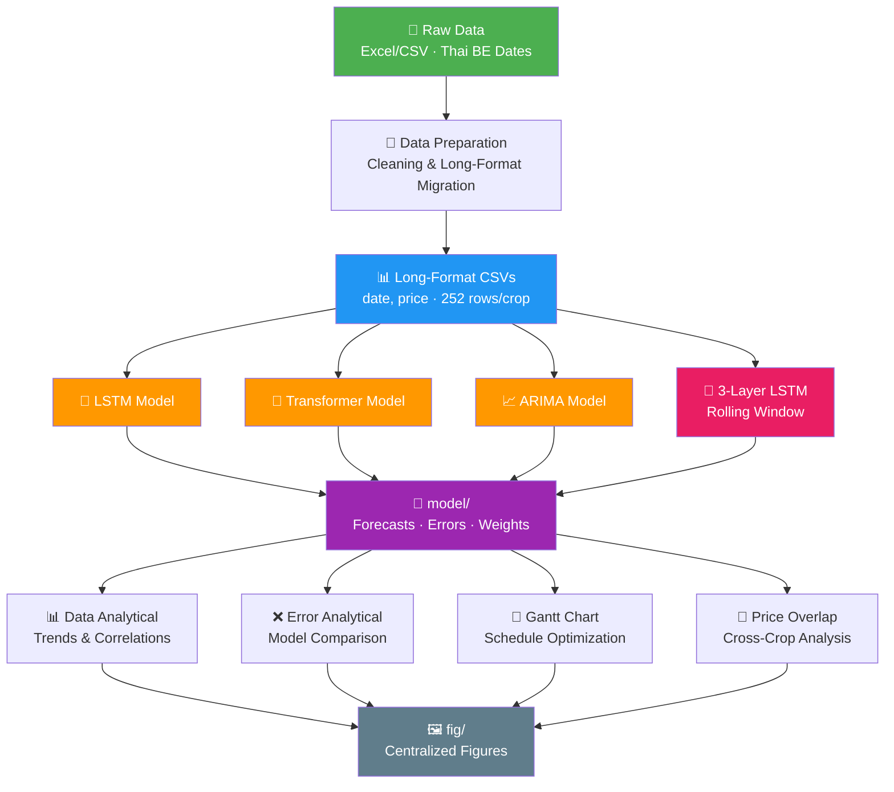
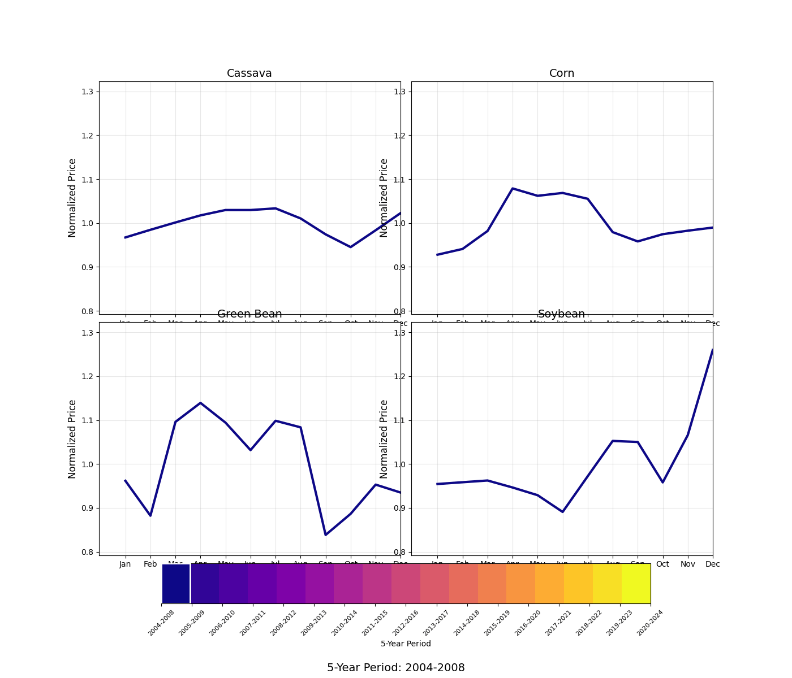
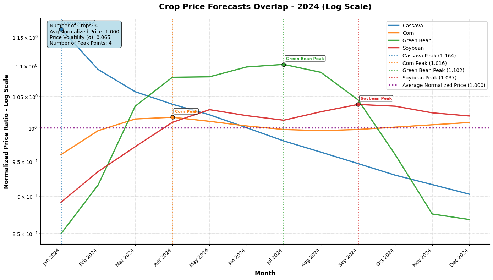

<div align="center">

# 🌾 AI Crop Land-Use Analysis & Price Forecasting

**Machine learning-powered crop price forecasting for Thai agricultural commodities**

[](https://python.org)
[](https://pytorch.org)
[](https://jupyter.org)
[](https://flask.palletsprojects.com)
[](https://scikit-learn.org)
[](LICENSE)

_Forecasting prices for **Cassava**, **Corn**, **Green Beans**, and **Soybean** using LSTM, Transformer, and ARIMA models — optimizing planting schedules for Thai farmers._

</div>

---

## 📋 Overview

This project analyzes **20 years** of Thai agricultural price data (2004–2024) and forecasts future crop prices using deep learning and statistical models. It generates optimized planting schedules via Gantt chart analysis to maximize farmer income.

### Key Capabilities

| Feature               | Description                                                 |
| --------------------- | ----------------------------------------------------------- |
| **Price Forecasting** | 1-year and 5-year horizons via LSTM, Transformer, and ARIMA |
| **3-Layer LSTM**      | Rolling-window advanced model powering final analysis       |
| **Gantt Schedule**    | Optimal planting-to-harvest windows with income estimation  |
| **Price Overlap**     | Cross-crop normalized price comparison on log scale         |
| **Error Analysis**    | MAE, RMSE, MAPE metrics across all models                   |
| **Web Interface**     | Flask-based dashboard for interactive exploration           |

---

## 🏗️ System Architecture



---

## 📁 Project Structure

```
AI Crop Land-Used/
├── config.yaml                    # Hyperparameters & paths
├── requirements.txt               # Dependencies
├── data/
│   ├── raw/                       # Original Excel/CSV (Thai BE dates)
│   ├── data_processed/            # Cleaned wide-format CSVs
│   └── long_format/               # Primary input: date,price per crop
├── src/
│   ├── model1/                    # Standard 1-year forecast notebooks
│   ├── model_advanced/            # 3-Layer rolling-window LSTM
│   ├── train/                     # Importable training scripts
│   ├── data preparation/          # Data cleaning & migration
│   ├── util/                      # Shared utilities (paths, models, I/O)
│   ├── reports/                   # Analysis reports (Markdown/CSV)
│   ├── Data Analytical.ipynb      # Historical trend analysis
│   ├── Error Analytical.ipynb     # Model error comparison
│   ├── Gantt chart.ipynb          # Planting schedule optimization
│   └── Overlap_price.ipynb        # Cross-crop price overlay
├── model/
│   ├── forecast_price/            # Forecast outputs per model
│   ├── error_record/              # Error metrics per model
│   └── weights/                   # Saved .pth model weights
└── fig/                           # All generated figures
    ├── model/forecast/            # Per-model forecast plots
    ├── model/error/               # Per-model error plots
    ├── analysis/image/            # Analytical charts per crop
    ├── analysis/trends/           # Long-term trend plots
    ├── analysis/transitions/      # Price animation GIFs
    ├── analysis/overlap/          # Normalized price overlap
    ├── final/lstm-3layer/         # 3-Layer LSTM per-crop figures
    └── final/gantt chart/         # Gantt schedule charts
```

---

## 🚀 Getting Started

### Prerequisites

- **Python 3.12+**
- **CUDA 12.6** _(optional, for GPU acceleration)_

### Installation

```bash
# Clone
git clone https://github.com/LoveMig6334/Ai-Crop-Land-Used.git
cd "AI Crop Land-Used"

# Create environment
python -m venv .venv
.venv\Scripts\activate        # Windows
# source .venv/bin/activate   # Linux/Mac

# Install dependencies
pip install -r requirements.txt

# (Optional) Install PyTorch with CUDA
pip install torch torchvision torchaudio --index-url https://download.pytorch.org/whl/cu126
```

### Running Models

```bash
# Standard 1-year forecasts
jupyter notebook "src/model1/(2) LSTM Model.ipynb"
jupyter notebook "src/model1/(2) Transformer Model.ipynb"
jupyter notebook "src/model1/(2) ARIMA Model.ipynb"

# Advanced 3-Layer LSTM (core model)
jupyter notebook "src/model_advanced/(4) LSTM 3 Layer.ipynb"

# Analysis notebooks
jupyter notebook "src/Data Analytical.ipynb"
jupyter notebook "src/Error Analytical.ipynb"
jupyter notebook "src/Gantt chart.ipynb"
jupyter notebook "src/Overlap_price.ipynb"

# CLI training scripts
python -m src.train.train_lstm --crop cassava
python -m src.train.train_transformer --crop corn
python -m src.train.train_arima --crop green_bean
```

---

## 📊 Sample Results

|                                                       |                                                                  |
| ----------------------------------------------------- | ---------------------------------------------------------------- |
| **20-Year Trend Comparison**                          | **Price Transition Animation**                                   |
|  |  |
| **Crop Price Overlap (Log Scale)**                    | **Forecast Example (LSTM)**                                      |
|           |                  |
| **Optimized Gantt Schedule**                          | **Baseline Gantt Schedule**                                      |
|        |                 |

---

## 📝 Data

| Property      | Value                               |
| ------------- | ----------------------------------- |
| **Period**    | 2547–2568 BE (2004–2025 CE)         |
| **Frequency** | Monthly                             |
| **Crops**     | Cassava, Corn, Green Beans, Soybean |
| **Format**    | Long-format CSV (`date, price`)     |
| **Currency**  | Thai Baht (THB)                     |

---

## 🤝 Contributing

1. Fork the repository
2. Create a feature branch: `git checkout -b feature/your-feature`
3. Commit changes: `git commit -m "Add feature: description"`
4. Push: `git push origin feature/your-feature`
5. Open a Pull Request

---

<div align="center">

_Built with ❤️ for sustainable agriculture and data-driven farming decisions_

**Last updated: March 2026**

</div>
