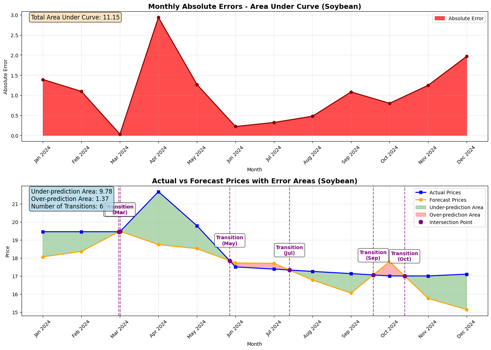

# AI Crop Land-Use Analysis and Price Forecasting

A machine learning project for analyzing and forecasting crop prices, specifically focusing on cassava, corn, green beans, and soybean agricultural commodities in Thailand. This project combines data preprocessing, visualization, and deep learning models to predict future crop prices based on historical data.

## 🌾 Project Overview

This project aims to:
- Analyze historical crop price data for cassava, corn, green beans, and soybean
- Clean and preprocess agricultural price data
- Visualize price trends and patterns
- Develop neural network models for price forecasting
- Calculate potential income per rai (Thai land measurement unit)
- Provide insights for agricultural decision-making

## 📁 Project Structure

```
AI Crop Land-Used/
├── GIL-TEST.py                        # Python GIL status testing utility
├── README.md                          # Project documentation
├── requirements.txt                   # Python dependencies
├── data/
│   ├── crops_info/
│   │   └── crops_info_data.txt        # Information about crops
│   ├── data_processed/
│   │   ├── cassava/
│   │   │   ├── price_avg.csv          # Processed cassava price data
│   │   │   └── price_low_high.csv     # Processed cassava min-max price data
│   │   ├── corn/
│   │   │   ├── price_avg.csv          # Processed corn price data
│   │   │   └── price_low_high.csv     # Processed corn min-max price data
│   │   ├── green_bean/
│   │   │   └── price_avg.csv          # Processed green beans price data
│   │   └── soybean/
│   │       └── price_avg.csv          # Processed soybean price data
│   └── raw/
│       ├── cassava/
│       │   ├── price_avg.xls          # Raw cassava price data (Excel)
│       │   └── price_min-max.xls      # Cassava min-max price data (Excel)
│       ├── corn/
│       │   ├── price_avg.xls          # Raw corn price data (Excel)
│       │   └── price_min-max.xls      # Corn min-max price data (Excel)
│       ├── green_bean/
│       │   └── price_avg.csv          # Raw green beans price data (CSV)
│       └── soybean/
│           └── price_avg.csv          # Raw soybean price data (CSV)
├── logs/                              # Application logs directory
├── src/                               # Source code directory
│   ├── app.py                         # Main web application module
│   ├── app_cli.py                     # Command-line interface application
│   ├── data preparation/              # Data preprocessing modules
│   │   ├── data_cleanup.py            # Data cleaning utilities
│   │   ├── data_plot.py               # Data visualization tools
│   │   └── raw_data_path.py           # Raw data path utilities
│   ├── model/
│   │   ├── (1) LSTM Model.ipynb       # LSTM-based forecasting model notebook
│   │   ├── (2) Transformer Model.ipynb # Transformer-based forecasting model notebook
│   │   ├── (3) ARIMA Model.ipynb      # Statistical forecasting model notebook
│   │   ├── Gantt chart.ipynb          # Crop planning and rotation visualization
│   │   ├── Overlap_price.ipynb        # Price overlap analysis notebook
│   │   ├── error_record/              # Error metrics organized by model type
│   │   │   ├── ARIMA/                 # ARIMA model error metrics
│   │   │   │   ├── cassava_error_metrics.txt
│   │   │   │   ├── corn_error_metrics.txt
│   │   │   │   ├── green_bean_error_metrics.txt
│   │   │   │   └── soybean_error_metrics.txt
│   │   │   ├── LSTM/                  # LSTM model error metrics
│   │   │   │   ├── cassava_error_metrics.txt
│   │   │   │   ├── corn_error_metrics.txt
│   │   │   │   ├── green_bean_error_metrics.txt
│   │   │   │   └── soybean_error_metrics.txt
│   │   │   └── Transformer/           # Transformer model error metrics
│   │   │       ├── cassava_error_metrics.txt
│   │   │       ├── corn_error_metrics.txt
│   │   │       ├── green_bean_error_metrics.txt
│   │   │       └── soybean_error_metrics.txt
│   │   ├── forecast_price/            # Model forecasts organized by model type
│   │   │   ├── ARIMA/                 # ARIMA model forecasts
│   │   │   │   ├── cassava_forecast.txt
│   │   │   │   ├── corn_forecast.txt
│   │   │   │   ├── green_bean_forecast.txt
│   │   │   │   └── soybean_forecast.txt
│   │   │   ├── LSTM/                  # LSTM model forecasts
│   │   │   │   ├── cassava_forecast.txt
│   │   │   │   ├── corn_forecast.txt
│   │   │   │   ├── green_bean_forecast.txt
│   │   │   │   └── soybean_forecast.txt
│   │   │   └── Transformer/           # Transformer model forecasts
│   │   │       ├── cassava_forecast.txt
│   │   │       ├── corn_forecast.txt
│   │   │       ├── green_bean_forecast.txt
│   │   │       └── soybean_forecast.txt
│   │   ├── image/
│   │   │   ├── error/                 # Error visualizations by model type
│   │   │   │   ├── ARIMA/
│   │   │   │   │   ├── cassava_error.png
│   │   │   │   │   ├── corn_error.png
│   │   │   │   │   ├── green_bean_error.png
│   │   │   │   │   └── soy_bean_error.png
│   │   │   │   ├── LSTM/
│   │   │   │   │   ├── cassava_error.png
│   │   │   │   │   ├── corn_error.png
│   │   │   │   │   ├── green_bean_error.png
│   │   │   │   │   └── soy_bean_error.png
│   │   │   │   └── Transformer/
│   │   │   │       ├── cassava_error.png
│   │   │   │       ├── corn_error.png
│   │   │   │       ├── green_bean_error.png
│   │   │   │       └── soy_bean_error.png
│   │   │   ├── forecast/              # Forecast visualizations by model type
│   │   │   │   ├── ARIMA/
│   │   │   │   │   ├── cassava.png
│   │   │   │   │   ├── corn.png
│   │   │   │   │   ├── green_bean.png
│   │   │   │   │   └── soy_bean.png
│   │   │   │   ├── LSTM/
│   │   │   │   │   ├── cassava.png
│   │   │   │   │   ├── corn.png
│   │   │   │   │   ├── green_bean.png
│   │   │   │   │   └── soy_bean.png
│   │   │   │   └── Transformer/
│   │   │   │       ├── cassava.png
│   │   │   │       ├── corn.png
│   │   │   │       ├── green_bean.png
│   │   │   │       └── soy_bean.png
│   │   │   ├── gantt chart/           # Gantt chart visualizations
│   │   │   │   ├── optimal.png        # Optimal crop rotation visualization
│   │   │   │   └── optimize.png       # Optimized crop rotation visualization
│   │   │   └── overlap/
│   │   │       └── output.png         # Price overlap visualization
│   │   └── util/                      # Model utility modules
│   │       ├── __init__.py
│   │       ├── data_path.py           # Data path utilities
│   │       ├── lstm_cust_class.py     # Custom LSTM model class
│   │       ├── parse_loc.py           # Location parsing utilities
│   │       ├── transformer_cust_class.py # Custom Transformer model class
│   │       └── __pycache__/           # Python cache files
│   └── utils/
│       ├── balance_price_calculation.py # Price balancing algorithms
│       ├── logger.py                  # Logging utilities
│       └── __pycache__/               # Python cache files
```

## 🚀 Features

- **Data Preprocessing**: Clean and prepare raw agricultural price data
- **Data Visualization**: Generate plots for price trend analysis
- **Time Series Forecasting**: 
  - LSTM-based neural network for price prediction
  - Transformer-based model for advanced sequence analysis
  - ARIMA statistical model for comparison
- **Multi-Crop Support**: Handles cassava, corn, green beans, and soybean price data
- **Thai Date Processing**: Handles Thai Buddhist calendar dates
- **Scalable Architecture**: Modular design for easy extension to other crops
- **Interactive Application**: Web-based interface for price analysis and forecasting
- **Price Balancing**: Algorithms for calculating balanced crop prices
- **Structured Logging**: Comprehensive logging system for debugging and monitoring
- **Gantt Chart Analysis**: Visualize optimal crop planting and harvesting schedules
- **Crop Rotation Optimization**: Optimize crop rotation patterns for maximum yield and profit

## 📊 Data Description

The project works with Thai agricultural price data:
- **Time Period**: 2547-2568 BE (2004-2025 CE)
- **Frequency**: Monthly price data
- **Crops**: Cassava, Corn, Green Beans, and Soybean
- **Price Types**: Average, minimum, and maximum prices
- **Currency**: Thai Baht (THB)
- **Additional Data**: Weather data for correlation analysis

## 🛠️ Installation

1. **Clone the repository**:
   ```bash
   git clone https://github.com/LoveMig6334/Ai-Crop-Land-Used.git
   cd "AI Crop Land-Used"
   ```

2. **Create Python Environment (version 3.12+)**:
   ```bash
   python -m venv .venv
   ```

   Alternative using Conda:
   ```bash
   conda create -n crop-forecasting python=3.12
   ```

3. **Activate the environment**:
   - Windows PowerShell:
   ```powershell
   .venv\Scripts\activate
   ```
   - Windows Command Prompt:
   ```cmd
   .venv\Scripts\activate.bat
   ```
   - Linux/Mac:
   ```bash
   source .venv/bin/activate
   ```
   - Conda (all platforms):
   ```bash
   conda activate crop-forecasting
   ```

4. **Install dependencies**:
   ```bash
   pip install -r requirements.txt
   ```

5. **Verify installation**:
   ```bash
   python -c "import torch; print(torch.__version__)"
   ```

6. **Verify GPU support** (Optional):
   ```bash
   python -c "import torch; print('GPU Available:', torch.cuda.is_available()); print('GPU Device:', torch.cuda.get_device_name(0) if torch.cuda.is_available() else 'None')"
   ```

7. **Check GIL and Python status** (Optional):
   ```bash
   python GIL-TEST.py
   ```

## 💻 Usage

### Price Forecasting

1. **Open the Jupyter notebook for preferred model**:
   ```bash
   jupyter notebook "src/model/(1) LSTM Model.ipynb"
   # or
   jupyter notebook "src/model/(2) Transformer Model.ipynb"
   # or
   jupyter notebook "src/model/(3) ARIMA Model.ipynb"
   ```

2. **Run the forecasting model**:
   - Execute all cells in the notebook
   - The model will train on historical data and generate predictions
   - Results will be saved as visualizations and text files in the `forecast_price` directory organized by model type

3. **Compare model results**:
   ```bash
   jupyter notebook "src/model/Overlap_price.ipynb"
   ```
   - View overlapping predictions from different models
   - Results will be saved in the `image/overlap` directory

4. **Analyze crop planting schedules**:
   ```bash
   jupyter notebook "src/model/Gantt chart.ipynb"
   ```
   - Visualize optimal planting and harvesting schedules
   - Compare optimized vs. non-optimized crop rotation patterns
   - Results will be saved in the `image/gantt chart` directory

### Income Analysis

1. **View income calculations per rai**:
   ```bash
   jupyter notebook "src/model/income_per_rai/income_plot.ipynb"
   ```
   - Analyze potential income based on forecasted prices
   - Results provide insights for optimal crop selection

### Web Application

1. **Start the web application**:
   ```bash
   python src/app.py
   ```

2. **Access the application**:
   - Open your browser and navigate to `http://localhost:5000`
   - Use the interactive dashboard to explore crop price data
   - Generate forecasts and visualizations through the web interface

3. **Use CLI version** (alternative):
   ```bash
   python src/app_cli.py
   ```
   - Command-line interface for quick data access
   - Generate reports and analysis from terminal

### Key Components

#### Data Cleaning (`data_cleanup.py`)
- Removes unwanted Thai language columns
- Standardizes data format
- Prepares data for analysis

#### Data Visualization (`data_plot.py`)
- Generates price trend plots
- Handles Thai date format conversion
- Provides statistical summaries

#### Web Application (`app.py` and `app_cli.py`)
- Interactive web interface for data exploration
- Command-line interface for quick access
- API endpoints for forecasting results
- User-friendly visualization dashboard

#### Price Analysis (`balance_price_calculation.py`)
- Algorithms for price equilibrium calculation
- Seasonal price adjustment methods
- Cross-crop price correlation analysis

#### Logger (`logger.py`)
- Structured logging system
- Error tracking and monitoring
- Performance metrics collection

#### Forecasting Models
**LSTM Model** (`(1) LSTM Model.ipynb`)
- LSTM neural network implementation
- Time series preprocessing with MinMaxScaler
- 12-month sequence input for 12-month prediction
- PyTorch-based deep learning pipeline

**Transformer Model** (`(2) Transformer Model.ipynb`)
- Self-attention based sequence model
- Advanced pattern recognition capabilities
- Parallelized computation for faster training
- State-of-the-art neural network architecture

**ARIMA Model** (`(3) ARIMA Model.ipynb`) 
- Statistical time series forecasting
- Auto-regressive Integrated Moving Average
- Traditional statistical approach for comparison

## 🧠 Model Architecture

The project implements three forecasting approaches:

**LSTM Model:**
- **Input**: 12 months of historical price data
- **Architecture**: LSTM (Long Short-Term Memory) neural network
- **Output**: 12 months of future price predictions
- **Framework**: PyTorch (v2.7.1)
- **Preprocessing**: MinMaxScaler for data normalization
- **Custom Implementation**: Uses `lstm_cust_class.py` for model definition

**Transformer Model:**
- **Input**: Historical price data sequence
- **Architecture**: Self-attention mechanism with encoding layers
- **Output**: Future price predictions with confidence intervals
- **Framework**: PyTorch (v2.7.1)
- **Advantages**: Better at capturing long-range dependencies in time series data
- **Custom Implementation**: Uses `transformer_cust_class.py` for model definition

**ARIMA Model:**
- **Input**: Historical time series data
- **Method**: Auto-Regressive Integrated Moving Average
- **Components**: AR (auto-regression), I (differencing), MA (moving average)
- **Libraries**: statsmodels, statsforecast

**Overlap Analysis:**
- Compares predictions from all three models
- Visualizes prediction differences
- Helps identify the most reliable forecasting approach for each crop

**Gantt Chart Analysis:**
- Visualizes crop planting and harvesting schedules
- Optimizes crop rotation patterns for maximum yield
- Identifies optimal timing for agricultural activities
- Shows both optimized and non-optimized schedules for comparison

## 📈 Results

The models generate:
- Price forecasts for the next 12 months
- Visualization of predicted vs. actual prices
- Performance metrics and validation results
- Saved forecast plots in the `src/model/image` directory
- Error analysis visualizations in `src/model/image/error`
- Comparative analysis between different forecasting approaches
- Income calculations per rai (Thai land measurement unit)

**Sample Visualizations:**

**Trend Graph Comparison:**


**Cassava Price Forecast:**


**Error Analysis:**


**Model Comparison:**


**Gantt Chart with non-optimized and optimized**


The output data files in `forecast_price/` contain detailed numerical predictions that can be used for further analysis or integrated into agricultural planning systems.

## 🔧 Technical Requirements

- **Python**: 3.12+
- **PyTorch**: 2.7.1 (with CUDA 12.6 support)
- **Key Libraries**:
  - pandas: 2.3.1 (Data manipulation)
  - numpy: 2.1.2 (Numerical computing)
  - matplotlib: 3.10.3 (Visualization)
  - scikit-learn: 1.7.1 (Data preprocessing)
  - statsmodels: 0.14.5 (Statistical modeling)
  - statsforecast: 2.0.2 (Forecasting algorithms)
  - jupyter: 1.1.1 (Interactive development)
  - fugue: 0.9.1 (Data processing)
  - coreforecast: 0.0.16 (Forecasting utilities)
  - Flask: 3.1.1 (Web application framework)

## 📝 Data Format

### Input Data Format (CSV)
```csv
year,1,2,3,4,5,6,7,8,9,10,11,12
2547,0.99,0.95,0.96,1.04,1.13,1.18,1.21,1.21,1.17,1.11,1.19,1.30
```
- Columns 1-12 represent months (January-December)
- Years in Thai Buddhist calendar (BE)
- Prices in Thai Baht

## 🙏 Acknowledgments

- Thai agricultural data sources
- PyTorch community for deep learning framework
- Agricultural research institutions for domain expertise

## 📞 Contact

For questions or collaboration opportunities, please open an issue or contact the project maintainers.

## 🤝 Contributing

Contributions to improve the project are welcome! Here's how you can contribute:

1. **Fork the repository**
2. **Create a feature branch**:
   ```bash
   git checkout -b feature/your-feature-name
   ```
3. **Commit your changes**:
   ```bash
   git commit -m "Add feature: description of your changes"
   ```
4. **Push to your branch**:
   ```bash
   git push origin feature/your-feature-name
   ```
5. **Create a Pull Request**

### Areas for Contribution
- Additional crop price datasets
- Improved model architectures
- Enhanced visualization tools
- Web interface improvements
- Documentation translation
- Testing and bug fixes

---

*Built with ❤️ for sustainable agriculture and data-driven farming decisions*

*Last updated: August 27, 2025*